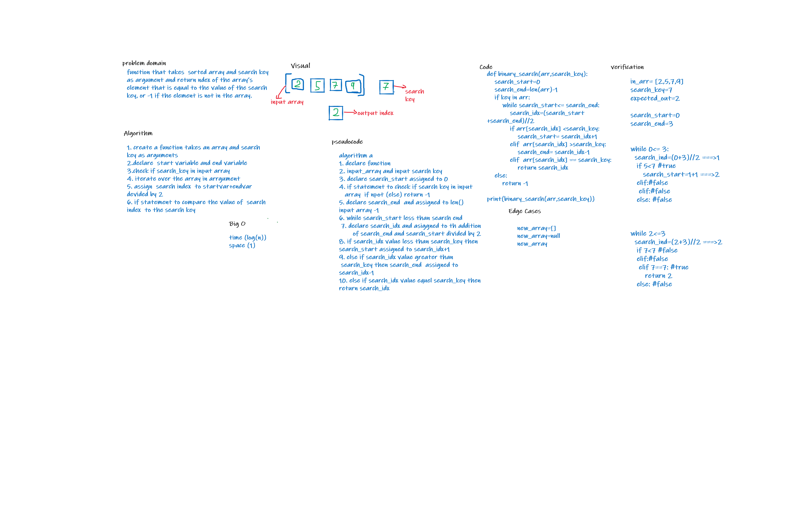

# Binary Search of Sorted Array
to write function that takes  sorted array and search key
as argument and return ndex of the array’s element that is equal to the value of the search key, or -1 if the element is not in the array.

## Whiteboard Process

## Approach & Efficiency
Approach binary search its required by the reuirements its more effeicient and has time efficient time compexity
