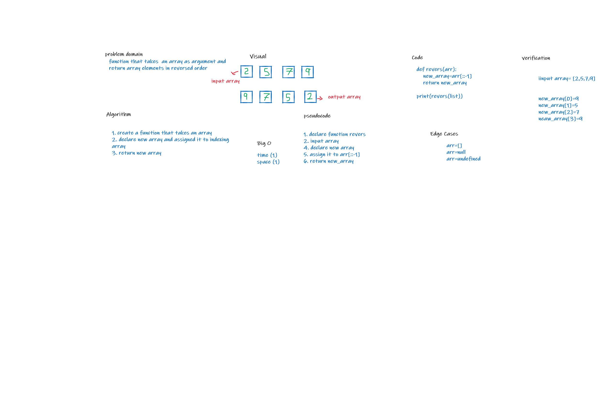

# Insert to Middle of an Array
function that takes array and returns the array elements in reversed order

## Whiteboard Process

## Approach & Efficiency
create new array to reverse the order to it it has linear time complexity and constant space complexity
