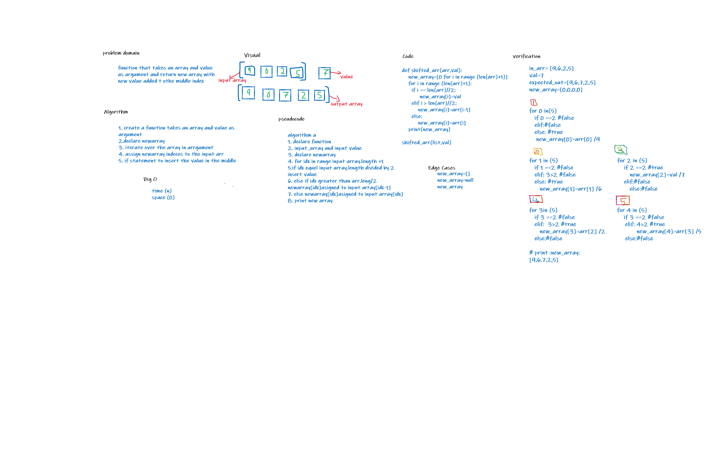

# Insert to Middle of an Array
function that takes array and value as arrguments and return new array with new value added to the middle index  

## Whiteboard Process

## Approach & Efficiency
create new array to add the new value to it it has linear time complexity and constant space complexity

