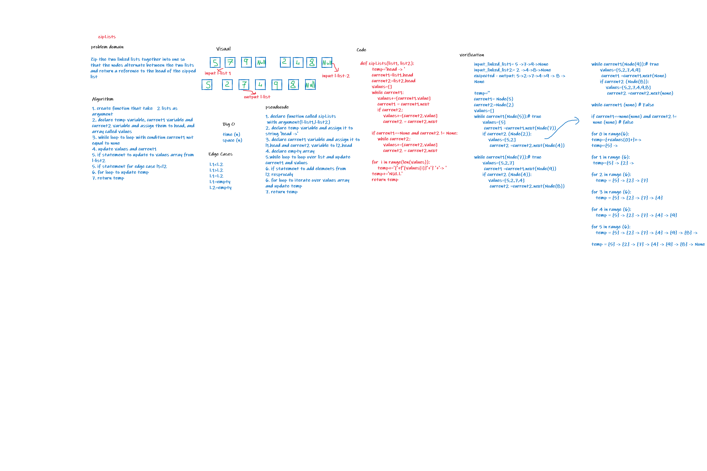

## Challenge Summary
 create a function to  compine 2 linked lists in one linked list reciprocally

 ## Whiteboard Process

## Approach & Efficiency

- time: O(n)
- space O(n)

## API
- zipLists: Zip the two linked lists together into one so that the nodes alternate between the two lists and return a reference to the head of the zipped list.

