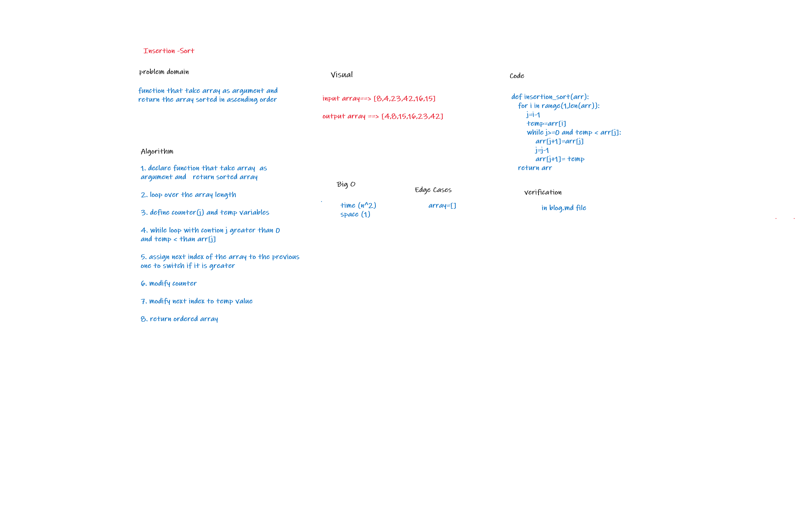

## Challenge Summary
- to create function that sort an array ascending 

## Whiteboard Process

## Approach & Efficiency
- time O(n2)  
- space O(1)

## Solution
function that take an array and  return the array  with ascendining order using insertion algorithm