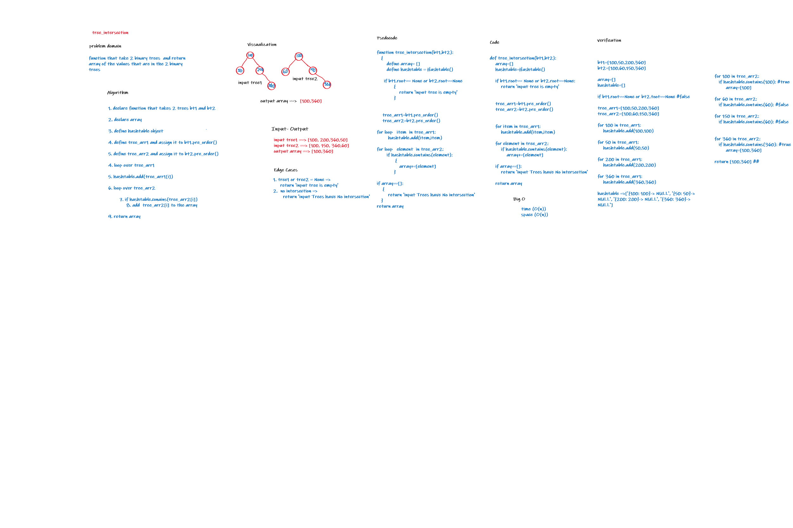

## Challenge Summary
 create a function that takes 2 binary trees and return the values that exisists in both of them
 ## Whiteboard Process

## Approach & Efficiency

- time: O(n)
- space O(n)

## Solution:
- tree_intersection: that takes an argument a 2 binary tree and return the values that exisists in both of them
