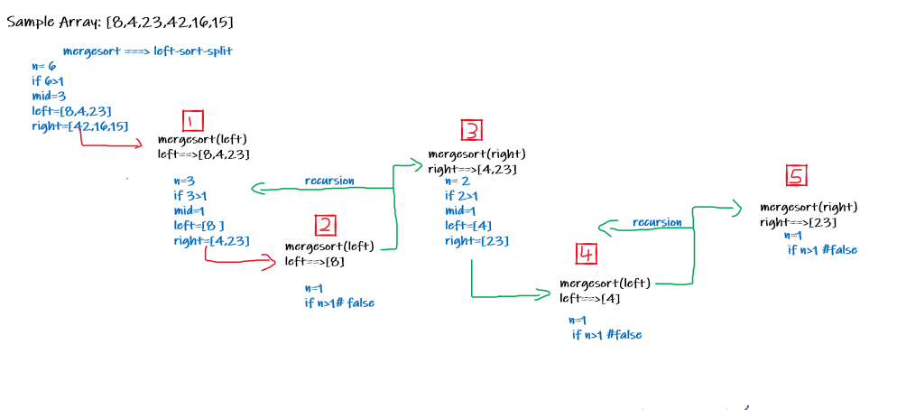
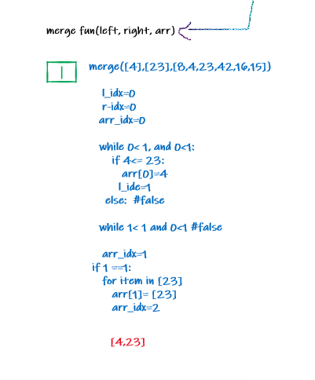
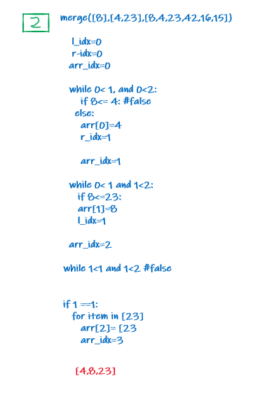
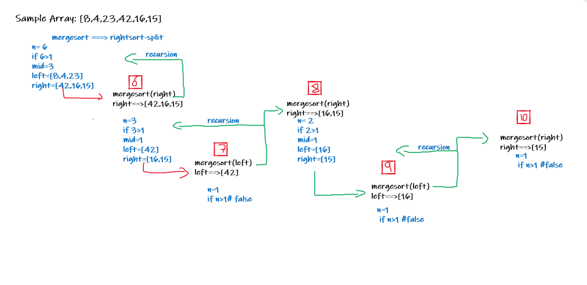
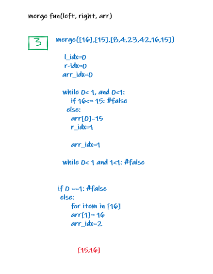
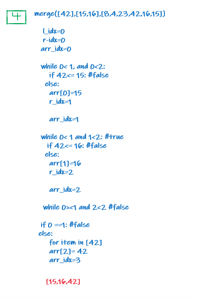

# Merge Sort
## Description
Merge sort is a divide and conquer sorting algorithm. It recursiveley splits each portion of the origin array until it's comparing only two arrays with a single element each. It then merges the sorted subarrays back together.

## pseudocode
```
ALGORITHM Mergesort(arr)
    DECLARE n <-- arr.length
    if n > 1
      DECLARE mid <-- n/2
      DECLARE left <-- arr[0...mid]
      DECLARE right <-- arr[mid...n]
      // sort the left side
      Mergesort(left)
      // sort the right side
      Mergesort(right)
      // merge the sorted left and right sides together
      Merge(left, right, arr)
ALGORITHM Merge(left, right, arr)
    DECLARE i <-- 0
    DECLARE j <-- 0
    DECLARE k <-- 0
    while i < left.length && j < right.length
        if left[i] <= right[j]
            arr[k] <-- left[i]
            i <-- i + 1
        else
            arr[k] <-- right[j]
            j <-- j + 1
        k <-- k + 1
    if i = left.length
       set remaining entries in arr to remaining values in right
    else
       set remaining entries in arr to remaining values in left
```
## Trace

### Left Split


Split sample array into 2 halves: L and R,  Call mergesort on L, which will continue to split the lists in half until only 1 element remains.

### Sort and Merge Left Split of the Array


Once the left most pair has been split, stitch back together in order, first order.



Now the same process repeats for L, Stitch complete L backtogether in order.

### Right Split


Repeat the entire process for R , Call mergesort on R, which will continue to split the lists in half until only 1 element remains.

### Sort and Merge Left Split of the Array


Once the left most pair has been split, stitch back together in order, first order.



now the same process repeats for R, Stitch complete R backtogether in order.


