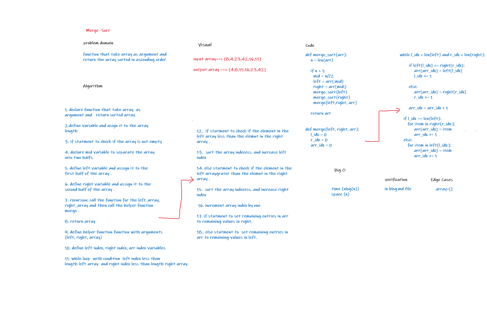

# Challenge Summary
 to create function that sort an array ascending 

## Whiteboard Process

## Approach & Efficiency
- time O(nlog(n))  
- space O(n)

## Solution
function that take an array and  return the array  with ascendining order using merge sort algorithm
