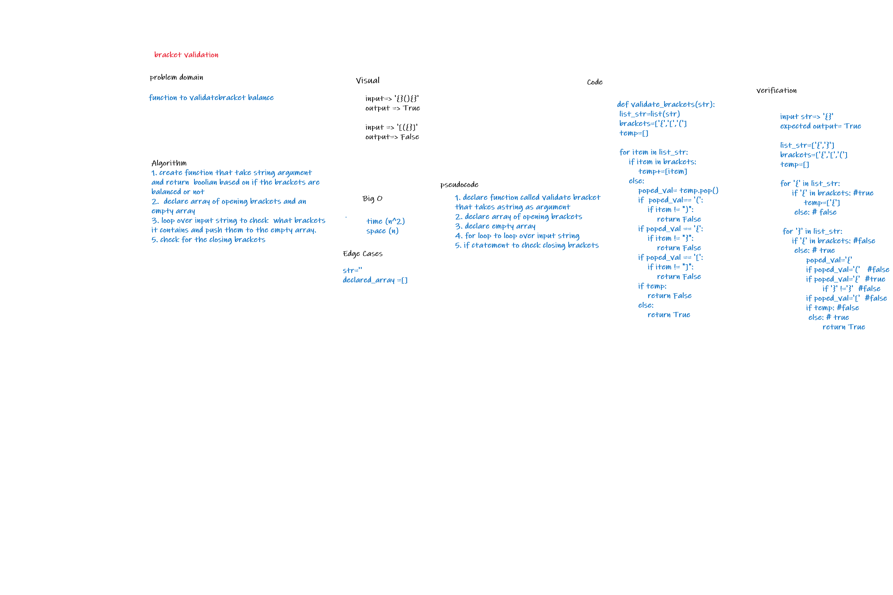

# Challenge Summary
- to create function to validated brackets balance

## Whiteboard Process

## Approach & Efficiency
- time O(n^2)  
- space O (n)
## Solution
function that validate the balance of a 3 pairs of branthesis