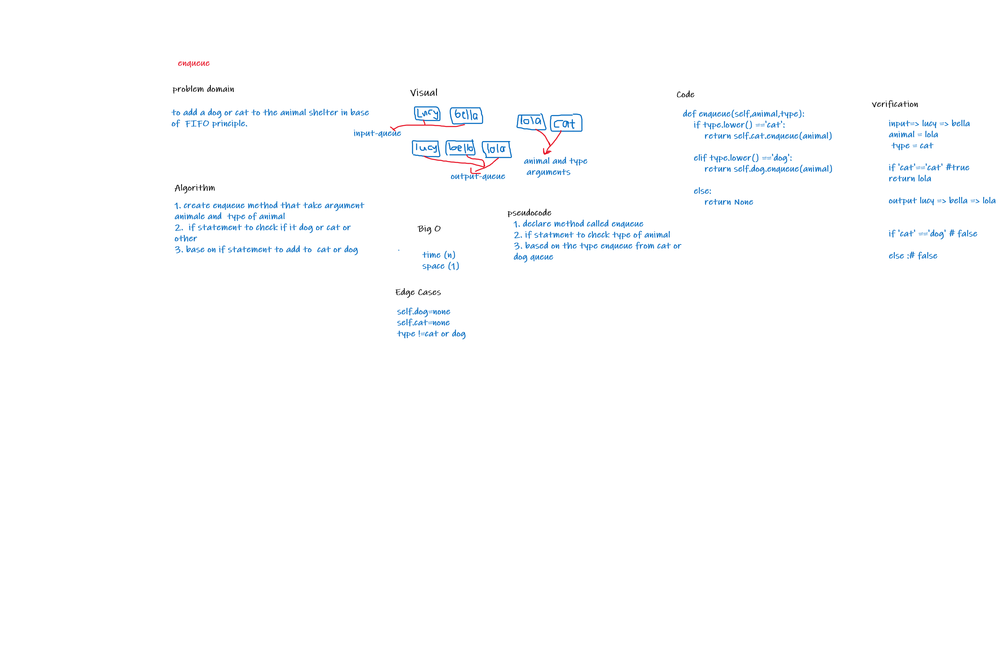
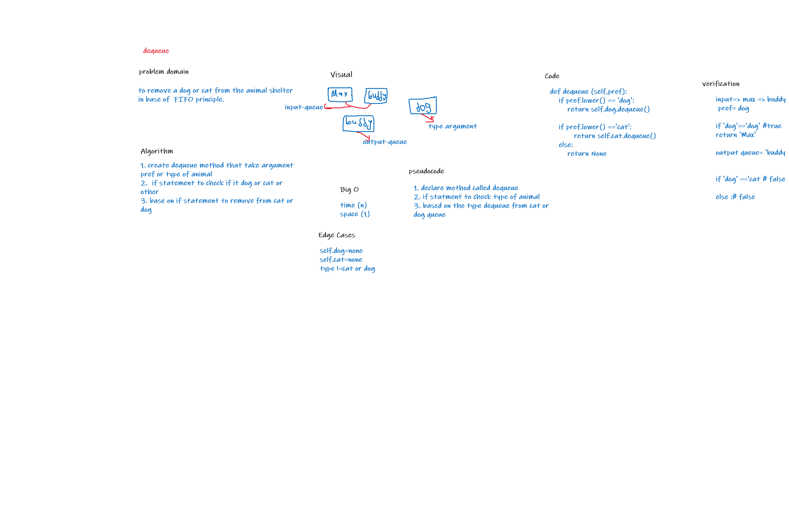

# Challenge Summary
- to create animalshelter class and add enqueue of dogs and cats and dequeue methods to it 

## Whiteboard Process

## Approach & Efficiency
- enqueue: time O(1)  , space O (1)
- dequeue: time O(n)  , space O (1)
## Solution
- enqueue: method that add to a animalshelte using queue methods in FIFo

- dequeue: method that remove from animalshelter using queue methods in FIFo