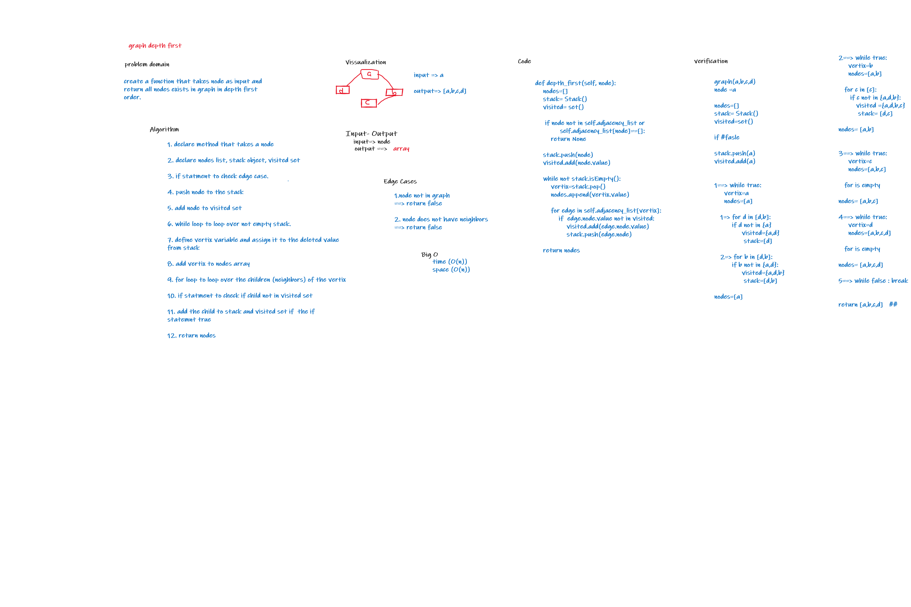

# Challenge Summary
create function  that takes node as input and return all nodes exists in graph in depth first order

## Whiteboard Process

## Approach & Efficiency
time:O(n)
space:O(n)

## Solution
- declare empty set(visited)
- declare empty queue
- enqueue the starting node
- create while loop and the condition that if the queue is not empty
- dequeue the node from the queue to the variable (current)
- add current to the set(visited)
- get the neighbors of the current
- enqueue the neighbors if its not in the set(visited)
- after the while return the nodes array