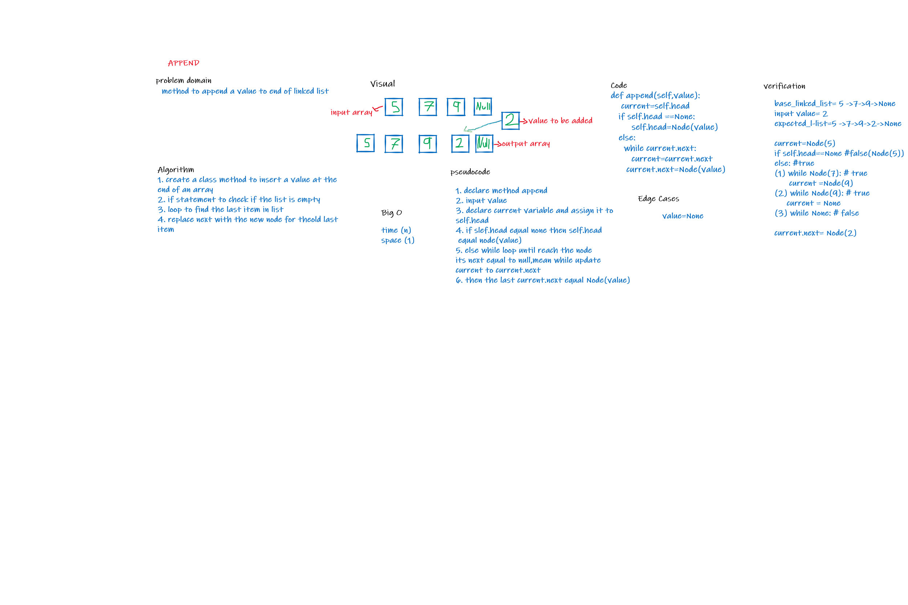
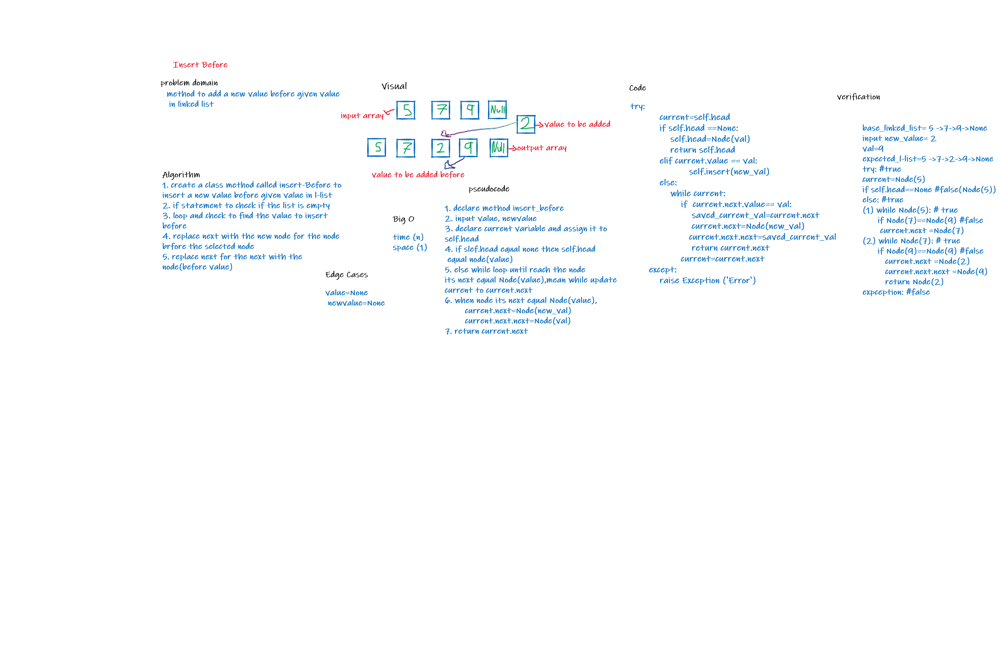
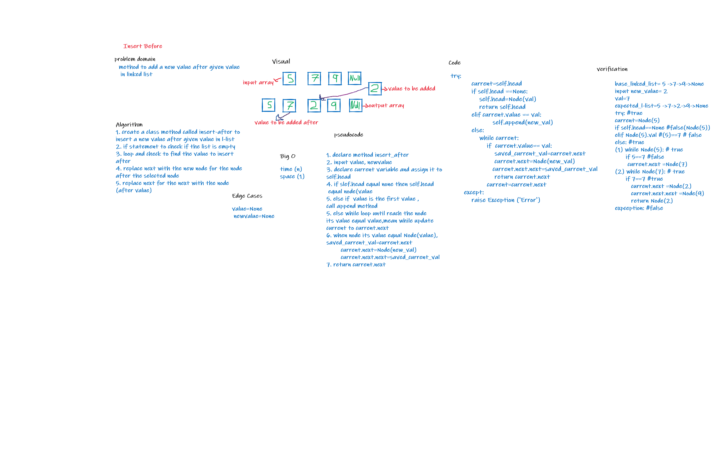
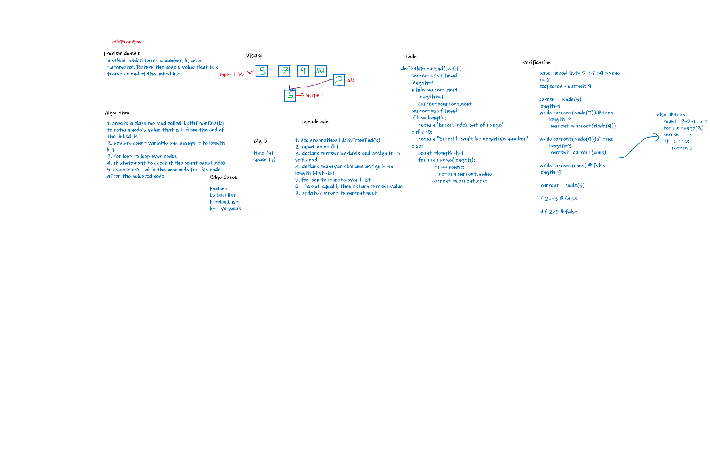

## Challenge Summary
to build linked list data structure and add  append insert-afterm insert-before  and kthFromEnd methods to linked list data structure

## Whiteboard Process

## Approach & Efficiency
Approach & Efficiency was choosen to be  big O for time and space:
- kthFromEnd: time O(n)  space O(1)
- append: time O(n)  space O(1)
- insert after: time O(n)  space O(1)
- insert before: time O(n)  space O(1)
- insert: time O(1) space O(1)
- include: time O(n)  space O(1)
- str: time O(n)  space O(1)

## API
- append: Adds a node of a value to the end of LL
- insert after: Adds a node of a value after a specified value of LL
- insert before:Adds a node of a value before a specified value of LL
- insert: Adds a node of a value to the head of LL
- include: Return T/F if value is in the linked list or not 
- str: print linked list values

